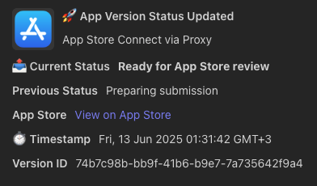
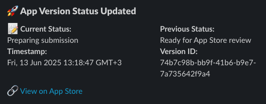

# App Store Webhook Proxy for Microsoft Teams & Slack

[](https://opensource.org/licenses/MIT)


[](coff.ee/alexiou)

[](https://render.com/deploy)

This project provides a simple, secure Node.js proxy to forward webhook events from **App Store Connect** to **Microsoft Teams** and/or **Slack**, including signature verification and platform-specific formatting.
---

## 🚀 Features

- ✅ Verifies App Store webhook signatures using HMAC SHA-256
- ✅ Forwards formatted messages to Microsoft Teams and Slack
- ✅ Custom message templates per platform
- ✅ Supports custom timezones for event timestamps
- ✅ Error handling and logging
- ✅ Dockerized and ready for deployment (e.g. Render, Railway)
- ✅ One-click deployable to Render

---

## 📋 Prerequisites
1. App Store Connect access with one of the following roles: **Account Holder**, **Admin**, or **App Manager** to create a webhook.
2. A configured workspace in either: Microsoft Teams and/or Slack

---

## 📦 Installation Guides
End-to-end simple installation guides, from installing the proxy to get the test message to MS Teams / Slack

### 💬 Microsoft Teams


**📘 Step-by-step setup guide**: [Integrate App Store Webhooks with Microsoft Teams (Medium)](https://medium.com/p/af3c8c840c15)

### 💬 Slack


**📘 Step-by-step setup guide**: [Integrate App Store Webhooks with Slack (Medium)](https://medium.com/p/4785b8306c81)

---

## ✅ Supported Webhook Events
- `appStoreVersionAppVersionStateUpdated`
- `webhookPingCreated`

Unknown events will still be delivered in raw JSON.

---

## 🔧 Proxy Setup Options
Here you can find all the available options to run the proxy.

### 1. Manual Setup (Node.js)
If you'd like to run the app directly with Node.js:

```bash
git clone https://github.com/yourusername/appstore-webhook-proxy.git
cd appstore-webhook-proxy
npm install
```

### 2. Docker Setup
Build and run using Docker:

```bash
docker build -t appstore-webhook-proxy .
docker run -p 3000:3000 --env-file .env appstore-webhook-proxy
```

### 3. One-Click Render Deployment
Click below to deploy instantly to Render:

[](https://render.com/deploy)

Make sure to set the following environment variables during setup:
- `SHARED_SECRET`
- `TEAMS_WEBHOOK_URL`
- `SLACK_WEBHOOK_URL`
- `APP_STORE_URL` (optional)
- `TIMEZONE` (e.g., Europe/Athens)

> Render automatically sets `NODE_ENV=production`

---

## ⚙️ Environment Variables

Create a `.env` file (or set variables directly in your cloud environment):

| Variable            | Explanation                                                                                                 | Default Value                                 |
|---------------------|-------------------------------------------------------------------------------------------------------------|-----------------------------------------------|
| `SHARED_SECRET`     | Secret used to verify incoming App Store Webhook requests. Set this value in App Store Connect and paste it here. | `your_shared_secret`                          |
| `TEAMS_WEBHOOK_URL` | Webhook URL for posting notifications to Microsoft Teams. Required if integrating with Teams; otherwise leave empty. Example: `https://your-teams.webhook.url` | *(empty)* |
| `SLACK_WEBHOOK_URL` | Webhook URL for posting notifications to Slack. Required if integrating with Slack; otherwise leave empty. Example: `https://hooks.slack.com/services/XXX/YYY/ZZZ` | *(empty)* |
| `APP_STORE_URL`     | *(Optional)* Public URL of your app on the App Store. Included in notification messages.                     | `https://apps.apple.com/app/id123456789`      |
| `TIMEZONE`          | Timezone used to format timestamps in messages. Use a valid IANA timezone name (e.g. `Europe/Athens`).       | `UTC`                                         |


You can also copy from the example:
```bash
cp .env.example .env
```

---

## 🧪 Running Locally

```bash
npm start
```
Then send a webhook POST to:
```
http://localhost:3000/appstore-webhook
```

---

## 🔐 Usefull App Store Connect info:
- When setting up the webhook in App Store Connect, Apple will ask for a **secret**. Use a string of your choice and set it in `SHARED_SECRET`.
- Official docs:
  - [Apple Webhook Notification Overview]()https://developer.apple.com/documentation/AppStoreConnectAPI/webhook-notifications
  - [Configuring Webhook Notifications](https://developer.apple.com/documentation/appstoreconnectapi/configuring-webhook-notifications)
  - [Webhook Permissions Guide](https://developer.apple.com/help/app-store-connect/manage-your-team/manage-webhooks)


---

## 📂 Project Structure

```
.
├── app.js                 # Entry point
├── routes/
│   └── webhook.js         # Webhook handler
├── utils/
│   ├── eventTemplates.js  # Teams formatter
│   ├── slackTemplates.js  # Slack formatter
│   └── stateDescriptions.js
├── services/
│   ├── signatureVerifier.js
│   ├── teamsNotifier.js
│   └── slackNotifier.js
├── middleware/
│   ├── errorHandler.js
│   └── logging.js
├── Dockerfile
├── render.yaml            # Render deploy spec
├── .env.example
├── .dockerignore
├── .gitignore
└── README.md
```

---

## 💡 Contributing

PRs and feedback welcome! You can help with:
- More supported event types
- Custom Slack/Teams formatting
- Delivery logs and retry support

---

## 📝 License
MIT
